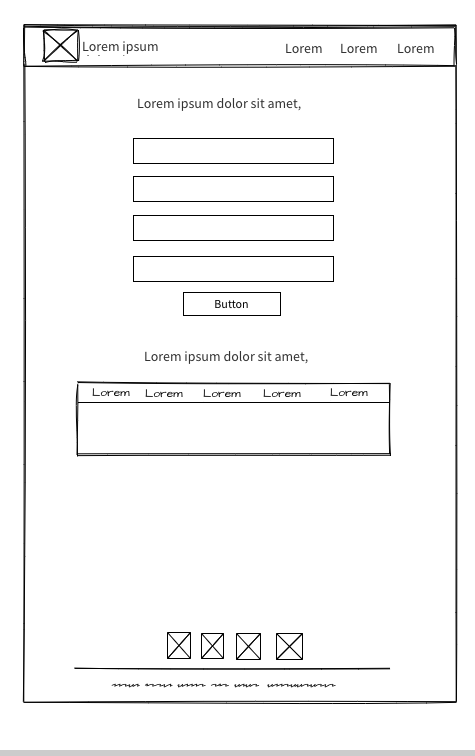

# Aplicación CRUD - PROYECTO 2 

## ÍNDICE
    - 1. Introducción
    - 2. Mockup
    - 3. Teclogías usadas
    - 4. Sitio web
    - 5. Agradecimientos

## Introducción

Este proyecto está basado en un prototipado simple, con la finalidad de hacer manipulación de datos atravéz de las cuatro funciones del CRUD 

Se suelen referir al acrónimo:

   - C - Crear ("Crear")
   - R - Leer ("Leer")
   - U - Actualizar ("Actualizar")
   - D - Borrar ("Borrar")

## Mockup

## Teclogías usadas

- HTML
- CSS
- Javascript

## Sitio web

https://joan-corporan.github.io/PROYECTO-2-CRUD/

## Agradecimientos
Quisiera agradecer a los profesores de la universidad, **Daniel Sepúlveda Pérez** y **Jonathan Demetrio Rodrigo Araya Robles**  por su paciencia y esfuerzo.

